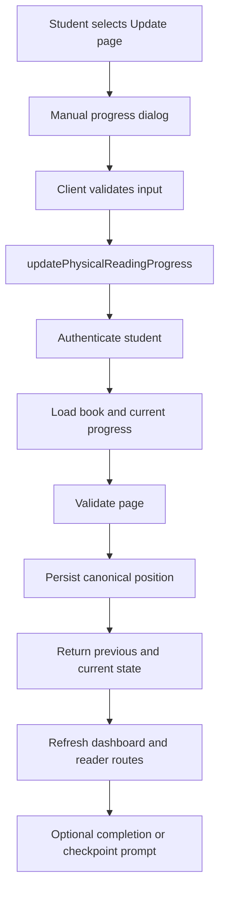

# Offline Reading Progress Synchronization

**Status:** In progress — Phase 1 complete

**Audience:** Product, frontend, backend, database, and QA engineers

**Primary owner:** Reading progress domain

**Last updated:** 2026-08-11

## 1. Purpose

This document defines how Reading Buddy will support students who read a physical copy of a catalogued book and later update the last page they reached in the application.

In this specification, **offline reading** means reading outside the Reading Buddy digital reader, normally using a physical book. It does **not** mean browser-offline/PWA support, background synchronization, or storing updates while the device has no network connection.

The implementation must extend the existing reading-progress flow. It must not create an unrelated progress record that can disagree with the progress shown by the dashboard or digital reader.

## 2. Problem statement

Reading Buddy currently updates progress automatically while a student uses the digital reader. A student reading the same title in a physical copy has no direct way to record their latest page.

The feature must let the authenticated student:

1. Open a book listed under **My Readings**.
2. Enter the last physical page they reached.
3. Save that page as their current reading progress.
4. See the updated progress throughout Reading Buddy.
5. Correct an accidentally entered page, including moving progress backward after confirmation.

The feature must not accidentally grant duplicate XP, inflate total pages read, update streaks without an agreed product policy, or resume an EPUB from a stale location.

## 3. Existing system

### 3.1 Canonical progress record

Reading progress is currently stored in `student_books`:

- `student_id`
- `book_id`
- `current_page`
- `epub_cfi`
- `progress_percent`
- `completed`
- `started_at`
- `completed_at`
- `updated_at`

The unique constraint on `(student_id, book_id)` makes this row the canonical latest state for one student and one book.

### 3.2 Existing application entry points

| Responsibility | Current location |
|---|---|
| Progress server action | `web/src/app/(dashboard)/dashboard/student/actions.ts` |
| Automatic reader save | `web/src/components/dashboard/UnifiedBookReader.tsx` |
| Reader initialization | `web/src/app/(dashboard)/dashboard/student/read/[bookId]/page.tsx` |
| Student reading cards | `web/src/app/(dashboard)/dashboard/student/page.tsx` |
| Student progress tests | `web/src/__tests__/app/student-actions.test.ts` |
| Main database schema | `database-setup.sql` |
| Self-hosted application schema | `sql/self-hosted/03-app-schema.sql` |
| Deploy migrations | `sql/migrations/` |
| TypeScript database types | `web/src/types/database.ts` |

### 3.3 Current risk in `recordReadingProgress`

The existing `recordReadingProgress()` action combines persistence and reading-activity side effects. A forward update may:

- create journal entries;
- update the reading streak;
- award page XP;
- increment `profiles.total_pages_read`; and
- evaluate badges.

It uses a process-local `lastPageReadCache` to calculate newly read pages. A process-local cache is not authoritative because it can be empty after a deployment, differ between application instances, and become inconsistent with PostgreSQL.

A manual physical-page form must therefore not call the current action unchanged. The previous page must be obtained from PostgreSQL, and side effects must be selected according to the progress source.

## 4. Goals and non-goals

### 4.1 Goals

- Reuse `student_books` as the canonical latest reading position.
- Let a student update a physical-book page from **My Readings**.
- Validate the page on the server against trusted book metadata.
- Distinguish digital-reader updates from manual physical-book updates.
- Prevent stale EPUB CFI data from overriding a manual update.
- Make identical submissions idempotent.
- Support confirmed backward corrections.
- Preserve current digital-reader behavior from the student's perspective.
- Define explicit behavior for gamification, completion, journals, and checkpoints.

### 4.2 Non-goals for the first release

- Browser-offline/PWA mutation queues.
- Synchronizing with Kindle, Kobo, Apple Books, or another external reader.
- Mapping printed edition pages precisely to reflowable EPUB locations.
- Teacher approval of every manual update.
- Historical reading analytics beyond the optional event model described below.
- Automatic book completion solely because the last page was entered.

## 5. Product rules

### 5.1 Canonical position

`student_books.current_page` remains the canonical page displayed by dashboards and used as the page-based resume position.

### 5.2 Supported books

The manual update control may be shown for every book with a valid catalog record. Validation behavior depends on `books.page_count`:

- When `page_count` is known, the page must be between `1` and `page_count`, inclusive.
- When `page_count` is unknown, the page must be a positive integer and the UI must state that the total page count is unavailable.

For EPUB files, the UI must warn that a printed page and a reflowable EPUB location may not match exactly.

### 5.3 Forward updates

A page greater than the saved page is accepted after validation.

For the MVP, manual updates do not award page XP, increment total pages read, or update reading streaks. This prevents unverified manual input from changing competitive or reward-related data.

### 5.4 Same-page updates

Submitting the already saved page is a successful no-op:

- no database activity event is created;
- no XP or streak operation runs;
- the action returns the current state; and
- the UI displays that progress is already up to date.

### 5.5 Backward updates

A page lower than the saved page is allowed so students can correct mistakes. The client must show a confirmation before submission.

A backward correction must not:

- subtract XP;
- decrement `profiles.total_pages_read`;
- remove journal entries;
- reverse achievements; or
- change historical reading activity.

Server validation must still accept a backward update even though client confirmation is a UX requirement. The server must not trust a client-provided previous page.

### 5.6 Completion

Reaching `books.page_count` does not automatically mark a book complete.

After a final-page update, the UI asks whether the student wants to mark the book as finished. Confirmation uses the existing `markBookAsCompleted()` action. This preserves an intentional completion step and existing completion rewards.

### 5.7 Required checkpoint quizzes

Manual synchronization must not force an immediate redirect. After a successful update, the application may query `getPendingCheckpointForPage()` and show a message with a **Start quiz** action.

Example:

> You reached a required reading checkpoint. Take the quiz when you are ready.

The first implementation should preserve the existing automatic reader behavior unless product requirements explicitly change it.

## 6. Proposed architecture



### 6.1 Separation of responsibilities

Refactor progress handling into a persistence operation and source-aware activity processing.

```ts
type ReadingProgressSource = "digital_reader" | "manual_physical";

type SaveReadingPositionInput = {
  bookId: number;
  currentPage: number;
  epubCfi?: string | null;
  progressPercent?: number | null;
  source: ReadingProgressSource;
};

type SaveReadingPositionResult = {
  previousPage: number | null;
  currentPage: number;
  totalPages: number | null;
  progressPercent: number | null;
  source: ReadingProgressSource;
  changed: boolean;
  movedBackward: boolean;
  reachedFinalPage: boolean;
  isNewBook: boolean;
};
```

The implementation may keep these functions in `student/actions.ts` initially, but persistence and gamification logic must be independently testable.

Recommended conceptual structure:

```ts
async function saveReadingPosition(
  user: AuthenticatedUser,
  input: SaveReadingPositionInput,
): Promise<SaveReadingPositionResult>;

async function processDigitalReadingActivity(
  user: AuthenticatedUser,
  result: SaveReadingPositionResult,
): Promise<ActivityResult>;

export async function recordReadingProgress(input: DigitalProgressInput);

export async function updatePhysicalReadingProgress(
  input: ManualProgressInput,
);
```

### 6.2 Digital reader action

The existing reader continues to call `recordReadingProgress()`. The action must internally set:

```ts
source: "digital_reader"
```

The previous page must be read from PostgreSQL instead of `lastPageReadCache`. Only a positive database-backed page delta may be considered for reading activity:

```ts
const pagesAdvanced = Math.max(
  0,
  currentPage - (previousPage ?? 0),
);
```

The cache may be removed. It must not be the basis for XP, total pages, or streak decisions.

### 6.3 Manual physical-book action

Add a dedicated action:

```ts
type UpdatePhysicalReadingProgressInput = {
  bookId: number;
  currentPage: number;
};

export async function updatePhysicalReadingProgress(
  input: UpdatePhysicalReadingProgressInput,
): Promise<SaveReadingPositionResult>;
```

This action:

1. Authenticates the current user.
2. Verifies that the profile is a student if role enforcement is available in the current authentication contract.
3. Loads the book's `id`, `page_count`, and `file_format` from PostgreSQL.
4. Loads the student's current `student_books` row.
5. Validates the submitted page.
6. Calculates `progress_percent` on the server.
7. Upserts the canonical `student_books` row.
8. Clears stale `epub_cfi` when the manual page becomes canonical.
9. Sets the progress source and manual synchronization timestamp.
10. Does not run page XP, streak, or total-pages side effects.
11. Revalidates all routes that display this progress.
12. Returns structured state for success, no-op, checkpoint, and completion UI.

## 7. Database design

### 7.1 Required schema extension

Add source metadata to `student_books`:

```sql
ALTER TABLE student_books
ADD COLUMN IF NOT EXISTS progress_source VARCHAR(30)
  NOT NULL DEFAULT 'digital_reader',
ADD COLUMN IF NOT EXISTS last_manual_sync_at TIMESTAMPTZ;
```

Add a constraint idempotently. PostgreSQL does not support `ADD CONSTRAINT IF NOT EXISTS`, so the migration should use a guarded `DO` block:

```sql
DO $$
BEGIN
  IF NOT EXISTS (
    SELECT 1
    FROM pg_constraint
    WHERE conname = 'student_books_progress_source_check'
  ) THEN
    ALTER TABLE student_books
      ADD CONSTRAINT student_books_progress_source_check
      CHECK (progress_source IN ('digital_reader', 'manual_physical'));
  END IF;
END $$;
```

Existing records are treated as `digital_reader` because that is the only currently implemented save source.

### 7.2 Write behavior

For a digital-reader update:

```sql
progress_source = 'digital_reader',
last_manual_sync_at = student_books.last_manual_sync_at,
updated_at = NOW()
```

For a manual physical-book update:

```sql
current_page = :validated_page,
progress_percent = :calculated_percent,
epub_cfi = NULL,
progress_source = 'manual_physical',
last_manual_sync_at = NOW(),
updated_at = NOW()
```

Clearing `epub_cfi` is required because `StudentReadPage` currently prefers an existing CFI unless a page query parameter is supplied. Keeping an older CFI could resume the EPUB before the manually entered page.

### 7.3 Progress percentage

When `books.page_count` is known:

```ts
const progressPercent = Math.min(
  100,
  Number(((currentPage / pageCount) * 100).toFixed(2)),
);
```

When `page_count` is unknown, store `NULL`. Do not calculate against an estimated total such as 300 pages.

### 7.4 Migration locations

The schema change must be represented in all active installation paths:

1. Add a sortable deploy migration under `sql/migrations/`, for example:
   `20260811_add_manual_reading_progress_source.sql`.
2. Add that filename to `sql/deploy-migrations.txt` if the manifest exists.
3. Update `database-setup.sql` for new installations.
4. Update `sql/self-hosted/03-app-schema.sql`.
5. Update any actively used staging bootstrap schema.
6. Update `web/src/types/database.ts`.

The migration must be idempotent and safe for existing rows.

### 7.5 Optional event history

An append-only event table is not required for the MVP. It becomes recommended if manual reading later awards XP, teachers need an audit history, or weekly physical-reading analytics are introduced.

Suggested future schema:

```sql
CREATE TABLE IF NOT EXISTS reading_progress_events (
  id UUID PRIMARY KEY DEFAULT gen_random_uuid(),
  student_id UUID NOT NULL REFERENCES profiles(id) ON DELETE CASCADE,
  book_id INTEGER NOT NULL REFERENCES books(id) ON DELETE CASCADE,
  previous_page INTEGER,
  current_page INTEGER NOT NULL,
  source VARCHAR(30) NOT NULL,
  created_at TIMESTAMPTZ NOT NULL DEFAULT NOW(),
  CONSTRAINT reading_progress_events_source_check
    CHECK (source IN ('digital_reader', 'manual_physical'))
);
```

Do not add this table until a feature consumes the history.

## 8. Validation and authorization

All authoritative validation occurs in the server action.

### 8.1 Input validation

- `bookId` must be a positive integer.
- `currentPage` must be a finite integer.
- `currentPage` must be at least `1`.
- The book must exist.
- If `books.page_count` is known, `currentPage` must not exceed it.
- `progressPercent` and `previousPage` must not be accepted from the manual client.

### 8.2 Authorization

- The action uses the authenticated user's `profileId` as `student_id`.
- The client must never submit a `studentId`.
- Queries and writes must run through `queryWithContext()` using the authenticated `userId`.
- A student can update only their own `student_books` record.
- If catalog access restrictions are enforced elsewhere, the action must apply the same rule before creating a new `student_books` row.

### 8.3 Error contract

Use stable, user-safe errors. The UI should not parse database error text.

Recommended result union:

```ts
type ManualProgressResult =
  | {
      success: true;
      data: SaveReadingPositionResult;
    }
  | {
      success: false;
      code:
        | "UNAUTHENTICATED"
        | "FORBIDDEN"
        | "BOOK_NOT_FOUND"
        | "INVALID_PAGE"
        | "PAGE_EXCEEDS_BOOK"
        | "SAVE_FAILED";
      message: string;
    };
```

If existing project conventions prefer thrown errors for authentication and unexpected failures, the action may follow them, but validation errors should remain distinguishable and testable.

## 9. Concurrency and idempotency

The read of the previous page and update of `student_books` should be atomic. Preferred implementations are:

1. A transaction with `SELECT ... FOR UPDATE`, followed by insert/update; or
2. A single SQL statement/CTE that obtains the previous state and returns both previous and updated values.

This prevents two near-simultaneous reader/manual writes from calculating activity against the same old page.

The database remains last-write-wins for canonical position. `updated_at`, `progress_source`, and `last_manual_sync_at` expose the last accepted update.

Identical manual submissions must be treated as no-ops. Avoid changing `updated_at` or `last_manual_sync_at` for an identical page unless product analytics explicitly require recording the interaction.

## 10. EPUB and edition behavior

A printed page number cannot be mapped reliably to a reflowable EPUB CFI because location changes with edition, font size, viewport, and layout.

MVP behavior:

- Save the entered physical page to `current_page`.
- Clear `epub_cfi`.
- Preserve `progress_percent` calculated from catalog `page_count`, when available.
- Resume using page-based behavior on the next reader opening.
- Show an EPUB warning in the manual update dialog.

Suggested warning:

> Printed page numbers may not exactly match this EPUB edition. Reading Buddy will use your page as an approximate resume position.

A future edition-aware implementation may store separate `physical_current_page` and digital location fields, but that is outside this MVP.

## 11. User experience specification

### 11.1 Entry point

Add **Update page** to each book card in the **My Readings** section of:

`web/src/app/(dashboard)/dashboard/student/page.tsx`

Keep **Continue reading** as the primary digital-reader action.

The card should display:

- current page;
- total pages when known;
- percentage when known; and
- a subtle “Updated from physical book” label when `progress_source` is `manual_physical`.

Example:

```text
Current page: 57 of 310
Updated from physical book

[Continue reading] [Update page]
```

### 11.2 Dialog component

Create a client component such as:

`web/src/components/dashboard/student/UpdateReadingProgressDialog.tsx`

Required content:

- Book title
- Current saved page
- Total pages when available
- Numeric page input
- Cancel button
- Save progress button
- EPUB warning when applicable
- Loading, success, and error states

Suggested copy:

```text
Update your reading progress

What page did you reach in your physical book?
Current saved page: 42 of 310

Page [ 57 ]

[Cancel] [Save progress]
```

### 11.3 Client validation

Client validation improves feedback but does not replace server validation:

- input is required;
- input uses whole numbers;
- minimum is `1`;
- maximum is `page_count` when known; and
- save is disabled while a request is pending.

### 11.4 Backward confirmation

If the new page is lower than the displayed current page, show:

> Your saved progress is page 57. Change it back to page 42?

Actions:

- **Keep page 57**
- **Change to page 42**

### 11.5 Success states

Forward or backward change:

> Progress updated to page 57.

No-op:

> Your progress is already saved at page 57.

Final page:

> You reached the final page. Mark this book as finished?

### 11.6 Accessibility

- Use an accessible dialog primitive already present in the UI system when available.
- Give the numeric input a visible label.
- Associate validation text with the input using `aria-describedby`.
- Move focus to the first error or success message when appropriate.
- Support Escape to close when no request is pending.
- Do not communicate manual/digital source through color alone.

## 12. Query and type changes

### 12.1 Student dashboard query

Extend the **My Readings** query in `web/src/app/(dashboard)/dashboard/student/page.tsx` to select:

```sql
b.page_count,
b.file_format,
sb.progress_percent,
sb.progress_source,
sb.last_manual_sync_at
```

Map those values into the book-card data passed to the dialog.

### 12.2 Other dashboard calculation

`web/src/app/(dashboard)/dashboard/student/dashboard-actions.ts` currently estimates a total of 300 pages. Change it to select and use `books.page_count`. If the total is unknown, return `null` instead of an invented total and percentage.

### 12.3 TypeScript types

Update `StudentBook` in `web/src/types/database.ts`:

```ts
export type ReadingProgressSource =
  | "digital_reader"
  | "manual_physical";

export interface StudentBook {
  // existing fields
  progress_source: ReadingProgressSource;
  last_manual_sync_at: string | null;
}
```

Keep types aligned with actual schema nullability. Do not add fields such as `total_pages` or `status` to SQL writes unless they exist in the deployed table.

## 13. Cache revalidation

After a changed manual update, revalidate routes that display or consume the position:

```ts
revalidatePath("/dashboard/student");
revalidatePath("/dashboard");
revalidatePath(`/dashboard/student/read/${bookId}`);
revalidatePath(`/dashboard/journal/${bookId}`);
```

Use the actual journal route present in the application. Revalidation is unnecessary for a same-page no-op unless cached data could already be stale for another reason.

## 14. Gamification and journal policy

### 14.1 MVP policy

| Side effect | Digital reader | Manual physical update |
|---|---:|---:|
| Save canonical page | Yes | Yes |
| Save progress percentage | Yes | Yes |
| Save EPUB CFI | When supplied | Clear stale value |
| Update reading streak | Existing behavior | No |
| Award page XP | Existing behavior | No |
| Increment total pages read | Existing behavior | No |
| Evaluate page badges | Existing behavior | No |
| Mark complete automatically | No | No |
| Create reading-session journal entry | Existing behavior | No by default |

A manual progress journal entry may be added later, but it must be explicitly labelled `manual_physical` and must not be interpreted as verified reading activity.

### 14.2 Future gamification

If manual physical reading later earns rewards, implement it using append-only, database-backed events with idempotency keys and abuse controls. Do not re-enable rewards by calculating from `student_books.current_page` alone.

Potential controls include:

- maximum rewarded manual pages per day;
- one reward event per book/page range;
- teacher-visible source labels; and
- correction events that do not reverse historical rewards automatically.

## 15. Implementation sequence

### Phase 1: Progress foundation — Complete

**Completed:** 2026-08-11

- [x] Introduce `ReadingProgressSource`.
- [x] Add schema fields and deploy migration.
- [x] Refactor persistence to read the previous page from PostgreSQL.
- [x] Remove `lastPageReadCache` as an authority for side effects.
- [x] Preserve current digital reader calls and behavior.
- [x] Add focused server-action tests.

Implementation notes:

- Digital progress saves are serialized per student/book pair with a PostgreSQL transaction-level advisory lock.
- Page activity side effects use the previous page loaded from PostgreSQL rather than process memory.
- Digital saves set `progress_source = 'digital_reader'` and preserve `last_manual_sync_at`.
- The schema update is represented in the deploy migration, primary bootstrap schema, self-hosted schema, staging bootstrap schema, and TypeScript database types.
- Focused server-action tests and the TypeScript type-check passed. ESLint reported no errors; the database helper retains four pre-existing `no-explicit-any` warnings.

### Phase 2: Manual update action and UI

1. Add `updatePhysicalReadingProgress()`.
2. Add server-side page validation and calculation.
3. Add `UpdateReadingProgressDialog`.
4. Add **Update page** to My Readings cards.
5. Display source and total-page information.
6. Add component tests.

### Phase 3: Completion and checkpoints

1. Prompt for completion after a final-page save.
2. Reuse `markBookAsCompleted()` after confirmation.
3. Surface pending checkpoints without forced navigation.
4. Add end-to-end coverage.

### Phase 4: Optional analytics and rewards

1. Add an event table only when required.
2. Define manual-reading reward policy.
3. Add teacher-facing source/history views.
4. Add abuse prevention and idempotent reward processing.

## 16. Testing requirements

### 16.1 Server-action tests

Extend `web/src/__tests__/app/student-actions.test.ts` or split progress tests into a dedicated file when it improves clarity.

Required cases:

1. Authenticated student inserts their first manual progress row.
2. Manual update changes an existing row.
3. Server calculates percentage from `books.page_count`.
4. Unknown page count produces `NULL` percentage.
5. Page below 1 is rejected.
6. Non-integer page is rejected.
7. Page above `page_count` is rejected.
8. Missing book is rejected.
9. The client cannot choose another `student_id`.
10. Manual update clears stale `epub_cfi`.
11. Manual update sets `progress_source = 'manual_physical'`.
12. Manual update sets `last_manual_sync_at` when changed.
13. Identical page is a no-op.
14. Backward update succeeds.
15. Backward update does not subtract historical statistics.
16. Manual update does not call `awardXP()`.
17. Manual update does not call `updateReadingStreak()`.
18. Manual update does not increment `profiles.total_pages_read`.
19. Digital updates continue to use `digital_reader`.
20. Digital page delta is based on the database's previous page, not process memory.
21. Concurrent updates do not duplicate digital activity side effects.

### 16.2 Component tests

Required dialog cases:

- shows current and total pages;
- validates empty, decimal, zero, negative, and over-limit input;
- disables duplicate submission while pending;
- displays server validation errors;
- confirms backward movement;
- displays a same-page message;
- displays an EPUB approximation warning;
- offers completion after the final page; and
- closes or updates local card state after success.

### 16.3 End-to-end scenario

1. Sign in as a student with a book saved at page 20.
2. Open **My Readings**.
3. Select **Update page**.
4. Enter page 35 and save.
5. Verify the card shows page 35 and manual source.
6. Reload and verify page 35 persists.
7. Open the digital reader and verify it resumes using the updated page rather than an old CFI.
8. Verify XP, streak, and total pages read did not change because of the manual update.
9. Change progress to page 30 and confirm the backward correction.
10. Verify historical rewards remain unchanged.

## 17. Acceptance criteria

The MVP is accepted when all of the following are true:

- [ ] A signed-in student can update a book's current page from **My Readings**.
- [ ] The action derives `student_id` from the authenticated session.
- [ ] The server rejects invalid and out-of-range pages.
- [ ] `student_books.current_page` remains the canonical latest position.
- [ ] Progress percentage uses `books.page_count`, not an estimate.
- [ ] Manual updates are identified as `manual_physical`.
- [ ] Manual updates clear stale EPUB CFI data.
- [ ] Same-page submissions are idempotent.
- [ ] Backward corrections require client confirmation and are accepted by the server.
- [ ] Manual updates do not award XP, alter streaks, or increment total pages in the MVP.
- [ ] Entering the final page does not automatically complete the book.
- [ ] The student can explicitly mark the book complete after a prompt.
- [ ] Existing digital-reader progress still saves successfully.
- [ ] Digital activity calculations no longer depend on process-local cache state.
- [ ] Dashboard, reader, and journal views show the updated page after revalidation.
- [ ] Automated tests cover validation, source behavior, no-op behavior, backward correction, stale CFI handling, and gamification isolation.

## 18. Definition of done

Development is complete when:

1. The deploy-safe migration and installation schemas are updated.
2. TypeScript database types match the schema.
3. Progress persistence is source-aware and database-backed.
4. The manual server action and accessible dialog are implemented.
5. Relevant dashboards use actual book page counts.
6. Unit/component tests pass.
7. The primary end-to-end scenario passes.
8. Lint and TypeScript checks pass for changed code.
9. Product copy and EPUB limitations are visible in the UI.
10. This document is updated if implementation decisions differ from the specification.

## 19. Open decisions

These decisions are intentionally deferred and must not block the MVP:

1. Should verified physical reading earn XP in a later release?
2. Should teachers see manual versus digital progress sources?
3. Should manual updates create journal entries by default?
4. Should some classrooms require checkpoint completion immediately after a manual update?
5. Is edition-level metadata needed to distinguish physical and digital page counts?
6. Is true no-network/PWA synchronization a separate roadmap feature?

Until those decisions are approved, implement the conservative MVP policies defined in this document.
